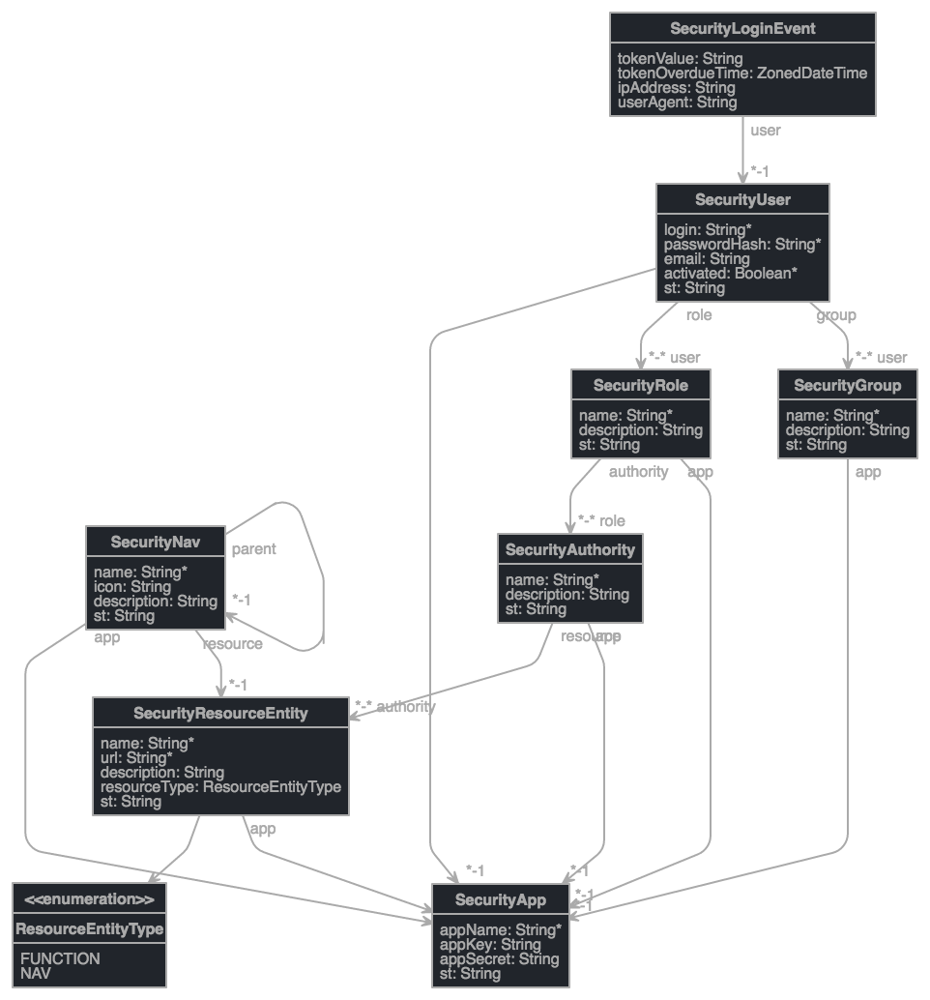

## Fort SDK

### 开始集成Fort SDK

*   [Requirements](docs/requirements.md)
*   [fort.yml](docs/fort-yml.md)
*   [Fort security http filter](docs/fort-filter.md)
*   [Spring component scan](docs/spring-component-scan.md)

## 使用Fort SDK

在项目启动时，会根据配置的server-base、app-key、app-secret连接到`fort server`. 并加载这个应用的全部资源（不包括用户），并启动web socket连接，及时接收服务器更新的资源。

*   [Fort Crud Client](docs/fort-crud-client.md)
*   [Security Utils](docs/security-utils.md)

## 实体关系图

